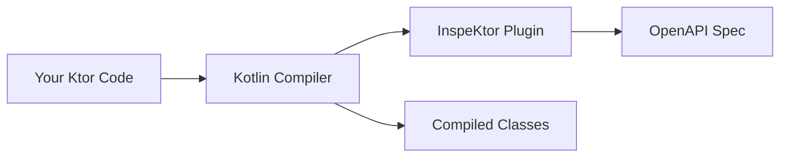

# Getting Started

Welcome to InspeKtor! This section will help you get up and running with automatic OpenAPI specification generation for
your Ktor server.

## Overview

InspeKtor is designed to be as simple as possible to integrate:

1. **Add the plugin** to your `build.gradle.kts`
2. **Annotate your routes** with `@GenerateOpenApi`
3. **Build your project** - that's it!

## Prerequisites

Before you begin, make sure you have:

- **Kotlin** 2.0 or higher (see [Compatibility](../about/compatibility.md) for version mapping)
- **Gradle** 7.0 or higher
- A **Ktor** server project

## What's Next?

- [:material-download: **Installation**](installation.md)

  Step-by-step guide to adding InspeKtor to your project

- [:material-rocket-launch: **Quick Start**](quick-start.md)

  Generate your first OpenAPI spec in under 5 minutes

- [:material-github: **Sample Project**](sample-project.md)

  Explore a complete working example

## How It Works

InspeKtor operates as a Kotlin compiler plugin, which means:

1. You write your Ktor routes as usual
2. You annotate entry points with `@GenerateOpenApi`
3. During compilation, InspeKtor analyzes your code
4. An `openapi.yaml` or `openapi.json` file is generated

**Key benefits of this approach:**

- **No runtime overhead** - Generation happens at build time only
- **No third party DSL** - Use standard Ktor routing syntax
- **Always accurate** - The spec is derived directly from your source code
